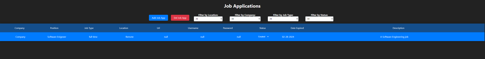

## Apps Organizer

Apps Organizer is a web application built using React and Express that helps users organize their job applications by allowing them to add and update the status of each application as it progresses through the hiring process.

### Features

-   Add new job applications with details such as company name, position, application date, etc.
-   Update the status of each application ("created", "pending", "rejected", "accepted", "in review", "interview").
-   View a list of all job applications along with their current status.
-   Edit or delete existing job applications as needed.

### Technologies Used

-   React: A JavaScript library for building user interfaces.
-   Express: A web application framework for Node.js used for building APIs and web servers.
-   LevelDB: Backend Local DB

### How to Use

1. Clone the repository:
    ```
    git clone https://github.com/dominusmars/apps-organizer.git
    ```
2. Navigate to the project directory:
    ```
    cd apps-organizer
    ```
3. Install dependencies:
    ```
    npm run install:all
    ```
4. Start the server:
    ```
    npm run start:prod
    ```
5. Open your web browser and navigate to `http://localhost:3000` to access the application.

### Screenshots



### Contact

For any inquiries or feedback, feel free to contact the project maintainer at [khawammohamad99@gmail.com](mailto:khawammohamad99@gmail.com).
